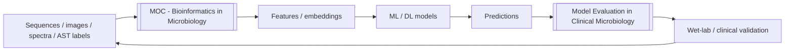

# MOC - AI in Microbiology

Artificial intelligence and machine learning applied to microbes — structure prediction, diagnostics, resistance, discovery, and surveillance.

**Parent:** [[Home]] · **Map:** [[Encyclopedia Map]]  
**Companion:** [[MOC - Bioinformatics in Microbiology]] (the data layer underneath) · **Media:** [[Learning Media Hub]]

## Overview

AI in microbiology learns patterns from large biological datasets — sequences, images, spectra, electronic records — to predict structures, identify organisms, infer resistance, design molecules, and detect outbreaks. It sits **on top of** bioinformatics outputs, and never replaces wet-lab confirmation ([[Antimicrobial Susceptibility Testing]], culture).

## 1. Methodological Foundations
- [[Machine Learning Basics for Microbiology]]
- [[Deep Learning in Microbiology]]
- [[Model Evaluation in Clinical Microbiology]]
- [[AI Ethics in Clinical Microbiology]]

## 2. Structure, Proteins, Design
- [[AlphaFold in Microbiology]]
- [[Protein Language Models]]
- [[Protein Design for Antimicrobials]]
- [[Structural Bioinformatics]]
- History: [[Demis Hassabis]] · [[John Jumper]] · [[David Baker]]

## 3. Diagnostics
- [[AI Diagnostics in Microbiology]]
- [[Digital Microscopy and Image AI]]
- [[Proteomics and MALDI Bioinformatics]] — spectral ML
- Host-response signatures → [[Microbial Transcriptomics]]

## 4. Resistance and Therapy
- [[Machine Learning for AMR Prediction]]
- [[Genotype to Phenotype Prediction]]
- [[AI in Antimicrobial Stewardship]]
- [[AI for Antibiotic Discovery]]

## 5. Prevention and Population Level
- [[AI for Vaccine Design]]
- [[AI for Outbreak Detection]]
- [[Phylodynamics]] — model-based epidemic inference
- [[Viral Genomics and Surveillance]]

## 6. Frontier
- [[Foundation Models and LLMs in Microbiology]]
- Genome-scale language models and *de novo* design
- Agentic AI running bioinformatics workflows ([[Reproducible Bioinformatics Workflows]])
- Self-driving laboratories: model proposes, robot tests, model updates

## Core Concepts to Internalize
- **Data quality dominates model choice.** Label noise from imperfect AST ceilings performance.
- **Population structure is the microbiology-specific confounder** — models learn lineages, not mechanisms.
- **Calibration and error types matter more than AUC** — very major errors are the currency of clinical acceptance.
- **Explainability** — clinicians act on reasons, not scores.
- **Human-in-the-loop** — AI proposes, laboratory confirms, clinician decides.
- **Drift** — pathogens and breakpoints change; models decay silently.

## Data & Resources

| Resource | Use |
| :--- | :--- |
| AlphaFold DB, PDB | Structures for design and mechanism |
| UniRef / UniProt | Pretraining protein language models |
| CARD / ResFinder / AMRFinderPlus | AMR labels and features ([[AMR Gene Databases]]) |
| NCBI Pathogen Detection, EnteroBase | Genomes + metadata at scale |
| PATRIC/BV-BRC | Genome–phenotype pairs |
| MIMIC / local EHR (governance!) | Clinical outcome models — privacy critical |
| Public AST collections (e.g., CRyPTIC for TB) | Benchmarks for genotype→phenotype |

## Important Methods & Inputs
- [[Whole-Genome Sequencing]] · [[PCR]] · [[Antimicrobial Susceptibility Testing]] · [[Gram Stain]]
- Pipelines: [[WGS Bioinformatics Pipeline]] · [[Bioinformatics Toolkit for Microbiology]]

## Important Papers
- [[Paper - AMR Database M.Centner 2026]] — database quality limits AI labels
- Add: AlphaFold2 (Jumper 2021); RoseTTAFold/RFdiffusion; halicin (Stokes 2020) and abaucin; ESM-2/ESMFold; TRIPOD+AI

## Research Questions
1. When is genomic ML accurate enough to replace phenotypic AST, and for which drug–bug pairs?
2. How do we detect model failure on novel plasmids or unseen species?
3. What governance is required before AI reads clinical Gram stains autonomously?
4. Can protein language models prioritize truly novel resistance determinants prospectively?
5. Do AI stewardship tools change patient outcomes, not just prescribing metrics?

## Review Article Opportunities
- Structure prediction → antimicrobial discovery: what actually reached the bench
- Clinical validation checklist for AMR prediction models
- AI for hard phenotypes: [[Biofilm]], persistence, tolerance
- LLMs in the clinical microbiology laboratory: realistic scope

## Learning Aids
- [[Figure - AI and Bioinformatics in Microbiology]]
- [[Figure - Machine Learning Workflow in Microbiology]]
- [[Computational Microbiology Study Path]]
- [[Bioinformatics and AI Glossary]]

## Related MOCs
- [[MOC - Bioinformatics in Microbiology]]
- [[MOC - Antimicrobial Resistance (AMR)]]
- [[MOC - Diagnostic & Lab Methods]]
- [[MOC - Antimicrobials]]
- [[MOC - Clinical Microbiology]]
- [[MOC - Public Health & Epidemiology]]
- [[MOC - Fundamentals of Microbiology]]

## Build Status
| Cluster | Status |
| :--- | :--- |
| ML/DL foundations + evaluation + ethics | done |
| Structure, protein LMs, design | done |
| Diagnostics and image AI | done |
| AMR, stewardship, discovery | done |
| Vaccines, outbreak detection | done |
| Foundation models / LLMs | done |
| Hands-on notebooks with real data | backlog |
