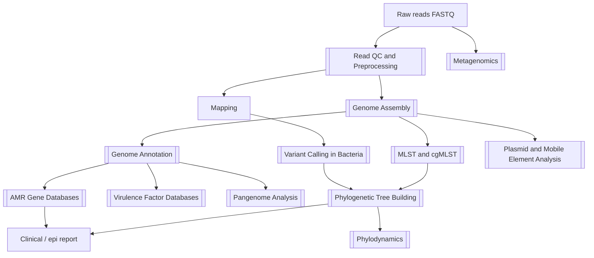

# MOC - Bioinformatics in Microbiology

![[banner-computational-microbiology.png]]

Computational analysis of microbial sequence and omics data — from raw reads to clinical and epidemiological interpretation.

**Parent:** [[Home]] · **Map:** [[Encyclopedia Map]]  
**Companion:** [[MOC - AI in Microbiology]] (learning models on these data)  
**Practical:** [[Bioinformatics Toolkit for Microbiology]] · [[Genomics Command-Line Cheatsheet]]

## Overview

Bioinformatics turns raw reads into **actionable microbial knowledge**: species ID, resistance and virulence genes, plasmids, community composition, and outbreak relatedness. Clinical microbiology increasingly depends on these pipelines downstream of [[Whole-Genome Sequencing]] and amplicon [[PCR]].

## 1. Data and Foundations
- [[Sequencing Technologies]] — Illumina, ONT, PacBio, Sanger
- [[Sequencing Data Formats]] — FASTQ, BAM, VCF, GFF
- [[Read QC and Preprocessing]]
- [[Sequence Alignment and BLAST]]
- [[Microbial Genomics]]

## 2. Genome Reconstruction and Interpretation
- [[Genome Assembly]] · [[Long-Read and Hybrid Bacterial Assembly]]
- [[Assembly Quality Control]] — CheckM / QUAST gates
- [[Contaminant and Mixed-Culture Detection]]
- [[Genome Annotation]]
- [[Variant Calling in Bacteria]]
- [[WGS Bioinformatics Pipeline]] — the end-to-end route
- [[Clinical WGS Pipelines]] — validated / accredited layer (Bactopia, nf-core, …)

## 3. Comparative and Population Genomics
- [[Comparative Genomics]]
- [[ANI and Species Delineation]] · [[GTDB Taxonomy]]
- [[Pangenome Analysis]] — core vs accessory
- [[Bacterial GWAS]] — structure-aware association
- [[Plasmid and Mobile Element Analysis]] · [[Prophage Detection and Annotation]]
- Biological drivers: [[Horizontal Gene Transfer]] · [[Integrons]] · [[Transposons and Insertion Sequences]] · [[Integrative Conjugative Elements]] · [[Genomic Islands]] · [[CRISPR-Cas in Bacteria]]

## 4. Typing, Phylogeny, Epidemiology
- [[MLST and cgMLST]]
- [[Population Structure and Clustering]] — PopPUNK / cluster naming
- [[Recombination in Bacterial Phylogenies]] — Gubbins / ClonalFrameML
- [[Phylogenomics and Outbreak Typing]]
- [[Phylogenetic Tree Building]]
- [[Phylodynamics]]
- [[Viral Genomics and Surveillance]]

## 5. Beyond the Genome (multi-omics)
- [[Microbial Transcriptomics]]
- [[Proteomics and MALDI Bioinformatics]]
- [[Structural Bioinformatics]]

## 6. Culture-Independent Analysis
- [[Metagenomics]]
- [[16S Amplicon Analysis]]
- [[Metagenome-Assembled Genomes]]
- [[Microbiome Statistics]]
- [[Plasmid Host Attribution with ML]] — when plasmids lack a cultured host

## 7. Clinical AMR Genomics
- [[AMR Gene Databases]]
- [[Virulence Factor Databases]]
- [[Genotype to Phenotype Prediction]]
- Ground truth: [[Antimicrobial Susceptibility Testing]]

## 8. Practice, Data Stewardship, Reproducibility
- [[Reproducible Bioinformatics Workflows]]
- [[Public Sequence Databases]]
- [[FAIR Data and Genomic Surveillance]]
- [[Bioinformatics Toolkit for Microbiology]]
- [[Genomics Command-Line Cheatsheet]]
- [[Bioinformatics and AI Glossary]]

## 9. Bridge to AI
- Feature tables → [[Machine Learning for AMR Prediction]] · [[Machine Learning Basics for Microbiology]]
- Confounders → [[Population Structure Confounding in Microbial ML]]
- Sequence → [[DNA and Genome Language Models]] · [[Protein Language Models]] · [[AlphaFold in Microbiology]]
- Agents → [[Agentic AI for Bioinformatics Workflows]]
- Hub: [[MOC - AI in Microbiology]]

## Core Principles
- Reference and **database versions are part of the result** ([[Reproducible Bioinformatics Workflows]])
- **Genotype ≠ phenotype** — correlate with [[Antimicrobial Susceptibility Testing]] when therapy depends on it
- Contamination, mixed cultures, and low coverage invalidate everything downstream ([[Contaminant and Mixed-Culture Detection]])
- Metadata quality limits epidemiological value more often than sequence quality
- Every clinical result must be traceable from report back to raw reads
- Recombination and population structure must be modeled before outbreak or GWAS claims

## Tool Reference Card

| Category | Examples | Question answered |
| :--- | :--- | :--- |
| QC | FastQC, MultiQC, fastp | Are reads usable? |
| Species screen | Kraken2, Mash, GTDB-Tk | What organism(s)? |
| Assembly | SPAdes, Unicycler, Flye, Shovill | What is the genome? |
| Assembly QC | QUAST, CheckM, BUSCO | Is it complete/clean? |
| Annotation | Prokka, Bakta, PGAP | Which genes? |
| Variants | BWA/minimap2, bcftools, Snippy | Which SNPs? |
| AMR | AMRFinderPlus, ResFinder, CARD-RGI | Which resistance determinants? |
| Typing | mlst, chewBBACA, Kleborate | Which lineage/cluster? |
| Plasmids | PlasmidFinder, MOB-suite, geNomad | Mobile context? |
| Pangenome | Roary, Panaroo, PPanGGOLiN | Core vs accessory? |
| Phylogeny | MAFFT, IQ-TREE, Gubbins, BEAST | How related, and when? |
| Metagenomics | MetaPhlAn, metaSPAdes, MetaBAT2 | What is in the community? |
| Amplicon | QIIME 2, DADA2 | Taxa from 16S? |
| Visualization | iTOL, Microreact, Bandage | How do I show it? |
| Orchestration | Nextflow/nf-core, Snakemake, Docker | How do I rerun it exactly? |

## Important Papers
- [[Paper - AMR Database M.Centner 2026]] — discordance between AMR databases and its downstream effects
- Add: MIMAG standards; nf-core; GTDB taxonomy; cgMLST scheme validations

## Important Book Chapters
- [[Jawetz, Melnick & Adelberg’s Medical Microbiology - Chapter 1]] — historical → molecular arc

## Research Questions
1. How should labs report “gene present, MIC susceptible”?
2. What minimum metadata makes AMR genomic surveillance interoperable?
3. When do plasmids demand long reads for clinical conclusions?
4. Can pangenome-aware references replace single-reference SNP calling in routine surveillance?
5. What is the acceptable failure mode when a pipeline meets a novel species?

## Review Article Opportunities
- Practical WGS pipeline for clinical microbiology laboratories
- Database discordance → reporting standards
- Metagenomic diagnostics: sensitivity, contamination, regulation
- From MAGs to clinical relevance: what is missing

## Learning Aids
- [[Figure - AI and Bioinformatics in Microbiology]]
- [[Figure - WGS Bioinformatics Pipeline]]
- [[Figure - Omics Layers in Microbiology]]
- [[Figure - Sequencing Platform Comparison]]
- [[Computational Microbiology Study Path]]
- [[Learning Media Hub]]

## Related MOCs
- [[MOC - AI in Microbiology]]
- [[MOC - Antimicrobial Resistance (AMR)]]
- [[MOC - Diagnostic & Lab Methods]]
- [[MOC - Bacteriology]]
- [[MOC - Public Health & Epidemiology]]
- [[MOC - Fundamentals of Microbiology]]

## Build Status
| Cluster | Status |
| :--- | :--- |
| Data foundations, assembly, annotation, variants | done |
| Assembly QC, long-read/hybrid, contamination gates | ✅ 2026-08-02 |
| Comparative / pangenome / plasmids / typing | done |
| ANI/GTDB, bacterial GWAS, recombination-aware trees, PopPUNK | ✅ |
| Clinical WGS pipelines + prophage annotation | ✅ |
| Phylogenetics and phylodynamics | done |
| Multi-omics (RNA, protein, structure) | done |
| Metagenomics, MAGs, microbiome statistics | done |
| Reproducibility, databases, FAIR, cheatsheet | done |
| Worked examples with real datasets | backlog |
