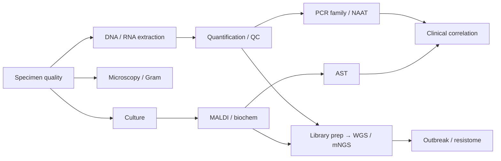

# MOC - Diagnostic & Lab Methods

Traditional and molecular methods for detecting, identifying, and characterizing pathogens — from microscopy to metagenomic sequencing.

**Parent:** [[Home]] · **Map:** [[Encyclopedia Map]]

## Overview

Diagnostics answer: *Is a pathogen present? Which one? What will treat it? Is this isolate related to an outbreak?* Methods trade speed, sensitivity, cost, and whether they recover a living organism for AST.

## Workflow Spine

## 1. Pre-analytics & Extraction
- [[Sample Types and Specimen Quality]] — the most common failure point
- [[DNA Extraction]] · [[RNA Extraction]] · [[Plasmid DNA Extraction]]
- [[Nucleic Acid Quantification]] — NanoDrop vs Qubit vs fragment analysis
- [[Gel Electrophoresis]] — classical fragment QC

## 2. Microscopy & Stains
- [[Microscopy]] · [[light microscope]]
- [[Gram Stain]]
- [[Acid-Fast Stain]]
- Imaging AI: [[Digital Microscopy and Image AI]]

## 3. Culture-Based
- [[Culture and Isolation]]
- [[MALDI-TOF MS]] — rapid ID from colonies
- [[Antimicrobial Susceptibility Testing]]
- [[Disk Diffusion]] · [[Broth Microdilution]] · [[MIC Testing]]

## 4. PCR & Amplification Family
- Core: [[PCR]] · inventor [[Kary Mullis]]
- Quantitative / real-time: [[qPCR]]
- RNA templates: [[Reverse Transcription Polymerase Chain Reaction (RT-PCR)]] · [[RT-PCR]]
- Multiplex & panels: [[Multiplex PCR]] · [[Syndromic Molecular Panels]]
- Specialized: [[Nested PCR]] · [[Digital PCR]] · [[Broad-Range 16S PCR]]
- Non-PCR NAAT: [[Isothermal NAAT]] (LAMP/RPA/…) · [[CRISPR-based Diagnostics]]

## 5. Sequencing & Genome Analysis (wet lab)
- [[Sanger Sequencing]] — amplicon confirmation / 16S ID
- [[NGS Library Preparation]]
- [[Targeted Enrichment]] — hybrid capture & amplicon tiling
- [[Whole-Genome Sequencing]] — isolate genomes
- [[Metagenomic NGS]] — culture-independent mNGS
- Platforms conceptually: [[Sequencing Technologies]]

## 6. Computational Layer (after the sequencer)
- [[Read QC and Preprocessing]] · [[Genome Assembly]] · [[Assembly Quality Control]]
- [[WGS Bioinformatics Pipeline]] · [[Clinical WGS Pipelines]]
- [[16S Amplicon Analysis]] · [[Metagenomics]] · [[Metagenome-Assembled Genomes]]
- AMR/virulence calling: [[AMR Gene Databases]] · [[Virulence Factor Databases]] · [[Genotype to Phenotype Prediction]]
- Hubs: [[MOC - Bioinformatics in Microbiology]] · [[MOC - AI in Microbiology]]
- Validation: [[Model Evaluation in Clinical Microbiology]] · [[Reproducible Bioinformatics Workflows]]
- AI-assisted readouts: [[AI Diagnostics in Microbiology]] · [[Proteomics and MALDI Bioinformatics]]

## 7. Serology & Antigen
- [[Serology in Clinical Microbiology]] · [[Antigen Detection Assays]]

## Core Concepts for Interpretation
- [[Pathogen]] vs [[Normal Microbiota]] (colonization — see [[PCR]] note)
- [[Infectious Disease]]
- [[Koch’s Postulates]] (causality mindset)
- [[Bacterial Growth Curve]] (why timing/inoculum matter)

## Important Organisms
- Method choice is organism-dependent — see [[MOC - Bacteriology]], [[MOC - Virology]]

## Important Book Chapters
- [[Jawetz, Melnick & Adelberg’s Medical Microbiology - Chapter 1]]

## Important Papers
- [[Paper - AMR Database M.Centner 2026]]

## Research Questions
1. When should genotypic resistance prediction replace phenotypic AST?
2. How do we report PCR positives that may be colonization?
3. What is the minimum WGS metadata for One Health AMR databases?
4. When is mNGS cost-effective versus syndromic PCR?
5. How should labs validate CRISPR diagnostics against qPCR?

## Related MOCs
- [[MOC - Fundamentals of Microbiology]]
- [[MOC - Clinical Microbiology]]
- [[MOC - Bacteriology]]
- [[MOC - Antimicrobial Resistance (AMR)]]
- [[MOC - Antimicrobials]]
- [[MOC - Bioinformatics in Microbiology]]
- [[MOC - AI in Microbiology]]

## Learning Aids

### Diagrams
- [[Figure - Diagnostic Workflow]]
- [[Figure - Gram Envelope Comparison]]
- [[Figure - WGS Bioinformatics Pipeline]]
- [[Figure - Sequencing Platform Comparison]]

### Clinical Example
> [!example]
> **Case:** Suspected acute meningitis. Clock is ticking.
> **Question:** Order the first 24h diagnostic moves.
> **Answer:** Blood cultures + LP → immediate CSF [[Gram Stain]] + cell count/chem → culture + [[Syndromic Molecular Panels|CNS multiplex PCR]] → ID/AST when growth; WGS if outbreak/unusual organism ([[Figure - Diagnostic Workflow]]).

### Videos
| Topic | Link |
| :--- | :--- |
| Gram concept | [Khan Academy](https://www.youtube.com/watch?v=FgsgpoFhleA) |
| Gram technique | [Hardy Diagnostics](https://www.youtube.com/watch?v=McINCWMbseI) |
| PCR principle | [DNA Learning Center](https://www.youtube.com/watch?v=2KoLnIwoZKU) |

Full index: [[Learning Media Hub]]

## Build Status
| Cluster | Status |
| :--- | :--- |
| Microscopy + Gram + AFB | ✅ |
| Culture + AST + MALDI | ✅ |
| Extraction + quantification | ✅ expanded 2026-08-02 |
| PCR family (qPCR, multiplex, dPCR, nested, 16S, RT) | ✅ |
| Isothermal + CRISPR NAAT | ✅ |
| Sanger + NGS wet lab (library, enrichment, WGS, mNGS) | ✅ |
| Serology / antigen deep notes | ✅ 2026-08-02 |
| Learning media | started |
