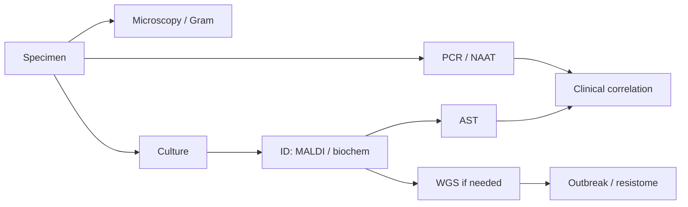

# MOC - Diagnostic & Lab Methods

Traditional and molecular methods for detecting, identifying, and characterizing pathogens.

**Parent:** [[Home]] · **Map:** [[Encyclopedia Map]]

## Overview

Diagnostics answer: *Is a pathogen present? Which one? What will treat it? Is this isolate related to an outbreak?* Methods trade speed, sensitivity, cost, and whether they recover a living organism for AST.

## Key Subtopics

### Microscopy & Stains
- [[light microscope]]
- [[Gram Stain]] — model method note for this vault
- [[Acid-Fast Stain]]

### Culture-Based
- [[Culture and Isolation]]
- [[Antimicrobial Susceptibility Testing]]
- Colony morphology / biochemical ID *(expand later)*
- MALDI-TOF *(TBD)*

### Molecular
- [[PCR]]
- [[Reverse Transcription Polymerase Chain Reaction (RT-PCR)]]
- [[MALDI-TOF MS]] — minutes-to-identification mass spectrometry
- Susceptibility: [[Disk Diffusion]] · [[Broth Microdilution]] · [[MIC Testing]]
- [[Microscopy]] — modalities overview
- [[Whole-Genome Sequencing]]
- 16S rRNA sequencing — [[16S Amplicon Analysis]] · [[Carl Woese]]
- Computational hubs: [[MOC - Bioinformatics in Microbiology]] · [[MOC - AI in Microbiology]]
- [[Sequencing Technologies]] · [[Read QC and Preprocessing]] · [[Genome Assembly]]
- [[Metagenomics]] — culture-independent diagnosis
- [[AI Diagnostics in Microbiology]] · [[Digital Microscopy and Image AI]] · [[Proteomics and MALDI Bioinformatics]]
- Validating any of it: [[Model Evaluation in Clinical Microbiology]] · [[Reproducible Bioinformatics Workflows]]

### Serology & Antigen
- Antigen assays / lateral flow *(TBD)*
- Antibody serology *(TBD)*

## Core Concepts for Interpretation
- [[Pathogen]] vs [[Normal Microbiota]] (colonization)
- [[Infectious Disease]]
- [[Koch’s Postulates]] (causality mindset)
- [[Bacterial Growth Curve]] (why timing/inoculum matter)

## Workflow Spine

## Important Organisms
- Method choice is organism-dependent — see [[MOC - Bacteriology]], [[MOC - Virology]]

## Important Book Chapters
- [[Jawetz, Melnick & Adelberg’s Medical Microbiology - Chapter 1]]

## Important Papers
- [[Paper - AMR Database M.Centner 2026]]

## Research Questions
1. When should genotypic resistance prediction replace phenotypic AST?
2. How do we report PCR positives that may be colonization?
3. What is the minimum WGS metadata for One Health AMR databases?

## Related MOCs
- [[MOC - Fundamentals of Microbiology]]
- [[MOC - Clinical Microbiology]]
- [[MOC - Bacteriology]]
- [[MOC - Antimicrobial Resistance (AMR)]]
- [[MOC - Antimicrobials]]

## Learning Aids

### Diagrams
- [[Figure - Diagnostic Workflow]]
- [[Figure - Gram Envelope Comparison]]

### Clinical Example
> [!example]
> **Case:** Suspected acute meningitis. Clock is ticking.
> **Question:** Order the first 24h diagnostic moves.
> **Answer:** Blood cultures + LP → immediate CSF [[Gram Stain]] + cell count/chem → culture + multiplex [[PCR]] → ID/AST when growth; interpret Gram within minutes to guide empiric therapy ([[Figure - Diagnostic Workflow]]).

### Videos
| Topic | Link |
| :--- | :--- |
| Gram concept | [Khan Academy](https://www.youtube.com/watch?v=FgsgpoFhleA) |
| Gram technique | [Hardy Diagnostics](https://www.youtube.com/watch?v=McINCWMbseI) |

Full index: [[Learning Media Hub]]

## Build Status
| Cluster | Status |
| :--- | :--- |
| Microscopy + Gram + AFB | strong / good |
| Culture + AST | done (core notes) |
| PCR / RT-PCR | exists — deepen panels later |
| WGS | core note done |
| Serology / MALDI | backlog |
| Learning media | started |
