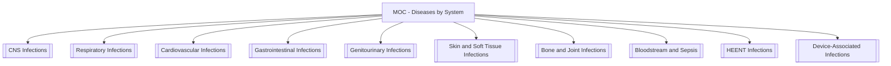

# MOC - Diseases by System

Infectious diseases mapped by organ system — pathogens, specimens, and links into organism + lab notes.

**Parent:** [[Home]] · **Map:** [[Encyclopedia Map]] · **Sister hub:** [[MOC - Clinical Microbiology]]

## Overview

Use this MOC when thinking **anatomy-first** (Where is the infection?).  
Use [[MOC - Clinical Microbiology]] when thinking **workflow-first** (Which specimen / method?).

Both hubs should stay cross-linked; disease notes live under `09-Microbiology/Diseases by System/`.

## Systems Index

| System hub | Disease notes (starter) | Starter pathogens |
| :--- | :--- | :--- |
| [[CNS Infections]] | [[Bacterial Meningitis]] | [[Streptococcus pneumoniae]] |
| [[Respiratory Infections]] | [[Community-Acquired Pneumonia]] · [[Hospital-Acquired Pneumonia]] | [[Streptococcus pneumoniae]] · [[Klebsiella pneumoniae]] · [[Pseudomonas aeruginosa]] · [[Staphylococcus aureus]] |
| [[Cardiovascular Infections]] | [[Infective Endocarditis]] | [[Staphylococcus aureus]] |
| [[Gastrointestinal Infections]] | [[Clostridioides difficile Infection]] | [[Escherichia coli]] · *C. difficile* |
| [[Genitourinary Infections]] | [[Acute Cystitis]] · [[Acute Pyelonephritis]] | [[Escherichia coli]] · [[Klebsiella pneumoniae]] |
| [[Skin and Soft Tissue Infections]] | [[Cellulitis and Skin Abscess]] · [[Necrotizing Soft Tissue Infection]] | [[Staphylococcus aureus]] · [[Streptococcus pyogenes]] |
| [[Bone and Joint Infections]] | [[Acute Osteomyelitis]] · [[Septic Arthritis]] | [[Staphylococcus aureus]] |
| [[Bloodstream and Sepsis]] | [[Sepsis]] · [[CLABSI]] | [[Staphylococcus aureus]] · Enterobacterales · [[Pseudomonas aeruginosa]] |
| [[HEENT Infections]] | [[Streptococcal Pharyngitis]] | [[Streptococcus pyogenes]] · [[Streptococcus pneumoniae]] |
| [[Device-Associated Infections]] | [[CLABSI]] · (VAP → [[Hospital-Acquired Pneumonia]]) | [[Staphylococcus aureus]] · [[Pseudomonas aeruginosa]] · [[Biofilm]] |

## All disease notes (Phase 1 set)

- [[Bacterial Meningitis]]
- [[Community-Acquired Pneumonia]] · [[Hospital-Acquired Pneumonia]]
- [[Infective Endocarditis]]
- [[Clostridioides difficile Infection]]
- [[Acute Cystitis]] · [[Acute Pyelonephritis]]
- [[Cellulitis and Skin Abscess]] · [[Necrotizing Soft Tissue Infection]]
- [[Acute Osteomyelitis]] · [[Septic Arthritis]]
- [[Sepsis]] · [[CLABSI]]
- [[Streptococcal Pharyngitis]]

Template for new diseases: [[Template - Disease]]

## Core Concepts
- [[Infectious Disease]] · [[Pathogen]] · [[Normal Microbiota]]
- [[Biofilm]] · [[Capsule]]
- [[Germ Theory]] · [[Koch’s Postulates]]

## Diagnostic and Lab Methods
- [[MOC - Diagnostic & Lab Methods]]
- [[Figure - Diagnostic Workflow]]
- [[Gram Stain]] · [[Culture and Isolation]] · [[PCR]] · [[Antimicrobial Susceptibility Testing]]

## Domain MOCs (etiology lenses)
- [[MOC - Bacteriology]] · [[MOC - Virology]] · [[MOC - Mycology]] · [[MOC - Parasitology]]
- [[MOC - Antimicrobials]] · [[MOC - Antimicrobial Resistance (AMR)]]
- [[MOC - Immunology]]

## Learning Aids
- Media hub: [[Learning Media Hub]]
- Workflow figure: [[Figure - Diagnostic Workflow]]

> [!example]
> **Case:** Fever + nuchal rigidity.
> **System first:** [[CNS Infections]] → CSF [[Gram Stain]] + culture/PCR → likely [[Streptococcus pneumoniae]] or meningococcus (page TBD).
> **Workflow twin:** same case under [[MOC - Clinical Microbiology]].

## Research Questions
1. Which syndromes still need culture for AST vs NAAT-first pathways?
2. How should system pages handle polymicrobial / microbiome-associated disease?

## Build Status
| Cluster | Status |
| :--- | :--- |
| This MOC + 10 system hubs | done |
| Starter individual disease notes (14) | done |
| Next diseases: TB, influenza, HSV encephalitis, gonorrhea, PJI, malaria… | backlog |
| Viral / fungal / parasitic depth per system | expand next |

## Related MOCs
- [[MOC - Clinical Microbiology]]
- [[MOC - Fundamentals of Microbiology]]
- [[MOC - Bacteriology]]
- [[MOC - Diagnostic & Lab Methods]]
