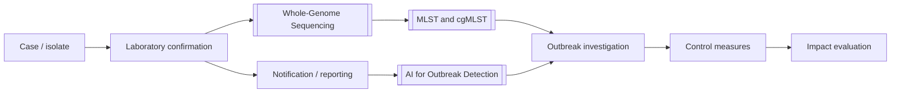

# MOC - Public Health & Epidemiology

How infections behave in populations — surveillance, outbreak investigation, prevention, and the governance around them.

**Parent:** [[Home]] · **Map:** [[Encyclopedia Map]]  
**Computational partners:** [[MOC - Bioinformatics in Microbiology]] · [[MOC - AI in Microbiology]]

## Overview

Clinical microbiology answers "what does this patient have?"; epidemiology answers "who else, where, why now, and how do we stop it?" Genomics has merged the two: the same isolate that guides therapy also becomes a surveillance data point.

## Key Subtopics

### Measuring disease
- [[Epidemiology]] — incidence, prevalence, R₀/Rt, study designs, outbreak investigation steps

### Surveillance
- Passive vs active; sentinel and syndromic systems
- Genomic surveillance — [[Phylogenomics and Outbreak Typing]] · [[Phylodynamics]] · [[Viral Genomics and Surveillance]]
- Automated signal detection — [[AI for Outbreak Detection]]
- Wastewater and environmental monitoring

### Prevention and control
- [[Vaccination]] and herd immunity — [[Edward Jenner]]
- [[Infection Prevention and Control]] — precautions, device bundles, hospital outbreaks
- Water, sanitation, food safety
- Outbreak response and communication

### AMR at population scale
- [[MOC - Antimicrobial Resistance (AMR)]] surveillance networks
- [[Antimicrobial Stewardship]] as a population intervention — [[AI in Antimicrobial Stewardship]]
- [[One Health]] — human, animal, environmental reservoirs
- [[ESKAPE Pathogens]] — the priority organism set

### Data governance
- [[FAIR Data and Genomic Surveillance]]
- [[Public Sequence Databases]]
- [[AI Ethics in Clinical Microbiology]]

## Core Concepts
- A cluster in time and space is a hypothesis; genomics tests it
- Surveillance quality is limited by metadata, not sequencing
- Interventions must be evaluated, not assumed
- Prevention (vaccines, hygiene) usually outperforms treatment at population scale

## Related MOCs
- [[MOC - Clinical Microbiology]] · [[MOC - Diseases by System]] · [[MOC - Antimicrobial Resistance (AMR)]] · [[MOC - Virology]] · [[MOC - Immunology]]

## Build Status
| Cluster | Status |
| :--- | :--- |
| MOC scaffold | done |
| Genomic surveillance links | done |
| Core notes: [[Epidemiology]], [[Infection Prevention and Control]], [[Vaccination]], [[One Health]] | done |
| Outbreak investigation worked example; food/water-borne disease notes | backlog |
