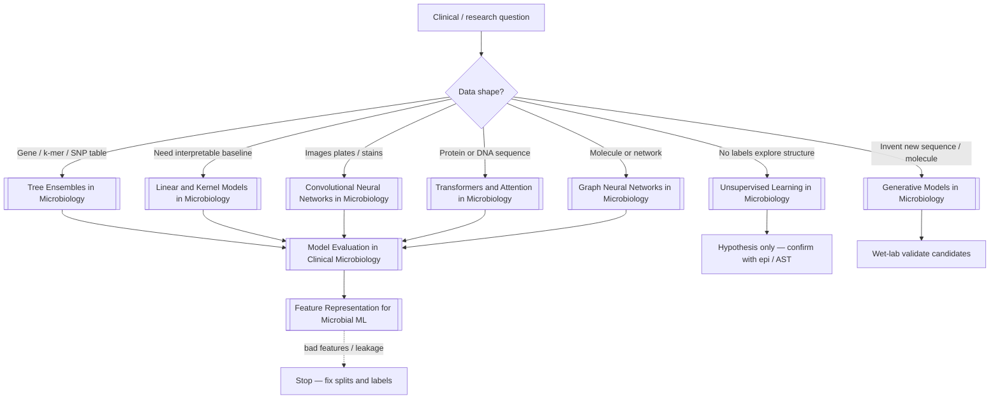

# Figure - AI Algorithm Selection in Microbiology

Quick chooser: data shape → first algorithm family. Details in [[AI Algorithms in Microbiology]].

## How to read it
- Start from data shape, not from hype.
- Every supervised path ends at evaluation; generative ends at the bench.
- Unsupervised paths are for exploration and QC, not R/S alone.

## Related
- [[Figure - Machine Learning Workflow in Microbiology]] · [[MOC - AI in Microbiology]]
