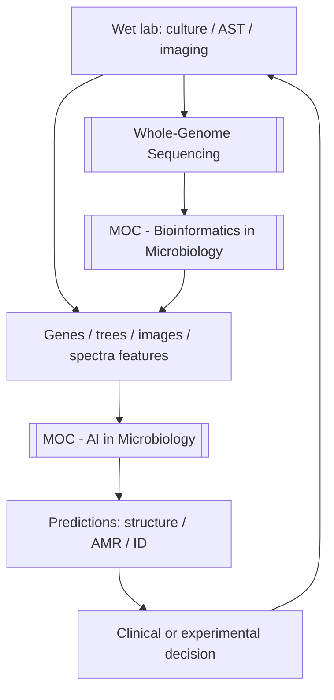

# Figure - AI and Bioinformatics in Microbiology

## Purpose
Show how bioinformatics data products feed AI models, and how both return to wet-lab validation.

## Used In
- [[MOC - AI in Microbiology]]
- [[MOC - Bioinformatics in Microbiology]]
- [[AI in Microbiology]]
- [[Learning Media Hub]]

## Diagram

## Teaching Legend
| Layer | Job | Example note |
| :--- | :--- | :--- |
| Wet lab | Ground truth | [[Antimicrobial Susceptibility Testing]] |
| Bioinformatics | Make data usable | [[WGS Bioinformatics Pipeline]] |
| AI | Learn patterns / generate | [[AlphaFold in Microbiology]] · [[Machine Learning for AMR Prediction]] |

## Quick Self-Check
1. Can AI replace AST today for most drugs/species?
2. Where do AMR database errors enter the AI stack?
