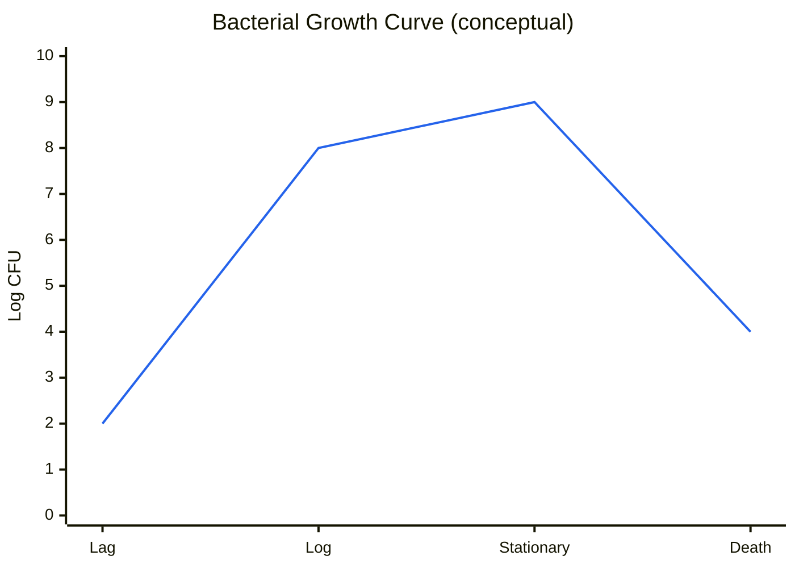
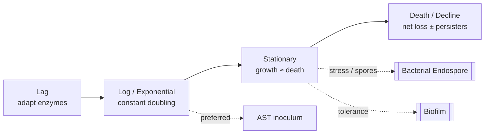

# Figure - Bacterial Growth Curve

## Purpose
Visualize lag → log → stationary → death and when labs/AST “care” about phase.

## Used In
- [[Bacterial Growth Curve]]
- [[Antimicrobial Susceptibility Testing]]
- [[Learning Media Hub]]

## Diagram

## Teaching Legend
| Phase | Physiology | Clinical / lab hook |
| :--- | :--- | :--- |
| Lag | Induction, little CFU rise | Fresh inoculum adapting |
| Log | Fast, uniform growth | Standard AST; many β-lactams need growth |
| Stationary | Nutrient stress | Persisters; sporulation in some spp. |
| Death | Net die-off | Old cultures → weird Gram variability |

## Quick Self-Check
1. Which phase for McFarland inoculum prep?
2. Why might a “susceptible” drug fail against non-growing cells?
