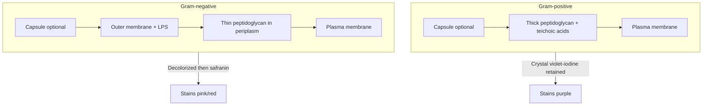

# Figure - Gram Envelope Comparison

## Purpose
Compare Gram-positive vs Gram-negative envelopes and connect structure → stain color → drug/target implications.

## Used In
- [[Gram Stain]]
- [[Bacterial Cell Wall]]
- [[MOC - Fundamentals of Microbiology]]
- [[Learning Media Hub]]

## Illustration

![[schematic-gram-envelope.png]]
*Left: Gram-positive — thick peptidoglycan over a single membrane. Right: Gram-negative — thin peptidoglycan in the periplasm, plus an outer membrane with porins and LPS. Conceptual schematic, AI-generated and reviewed; see [[Image Sources and Attribution]]. Not a micrograph.*

## Diagram

## Teaching Legend
| Layer | Gram+ | Gram− | Why it matters |
| :--- | :--- | :--- | :--- |
| Peptidoglycan | Thick | Thin | Stain retention; β-lactam target |
| Outer membrane | Absent | Present + LPS | Permeability barrier; endotoxin |
| Teichoic acids | Present | Absent | Surface charge / immune interactions |

## Quick Self-Check
1. Which layer traps the CV–I complex?
2. Why do mycobacteria break this figure’s assumptions?
