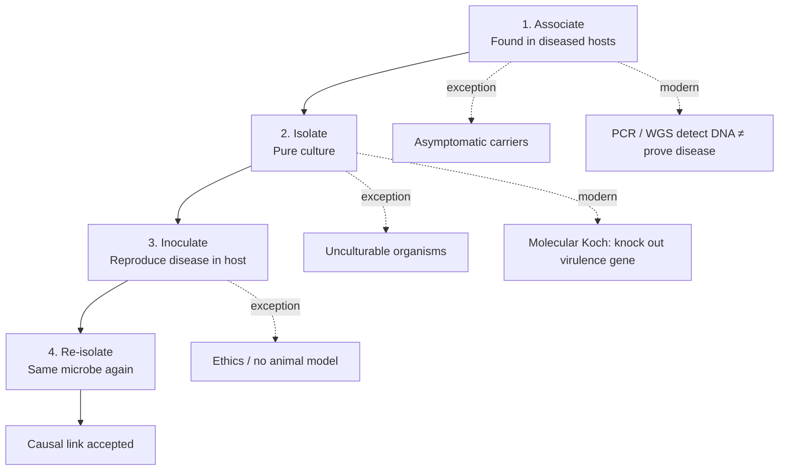

# Figure - Koch Postulates Flow

## Purpose
Show classical causality steps and where modern molecular diagnostics break or extend them.

## Used In
- [[Koch’s Postulates]]
- [[Germ Theory]]
- [[Robert Koch]]
- [[PCR]]
- [[Learning Media Hub]]

## Diagram

## Teaching Legend
| Step | Classical tool | Modern analogue |
| :--- | :--- | :--- |
| Associate | Microscopy / pathology | NAAT, metagenomics |
| Isolate | [[Culture and Isolation]] | Sometimes impossible → genes/markers |
| Causation | Animal challenge | Gene knockout / gain-of-function evidence |
| Confirm | Re-culture | Sequence identity / phylogeny |

## Quick Self-Check
1. Which postulate fails for viruses that cannot be cultured in cell-free media historically?
2. Why can a PCR+ nasal swab fail postulate-style causation?
