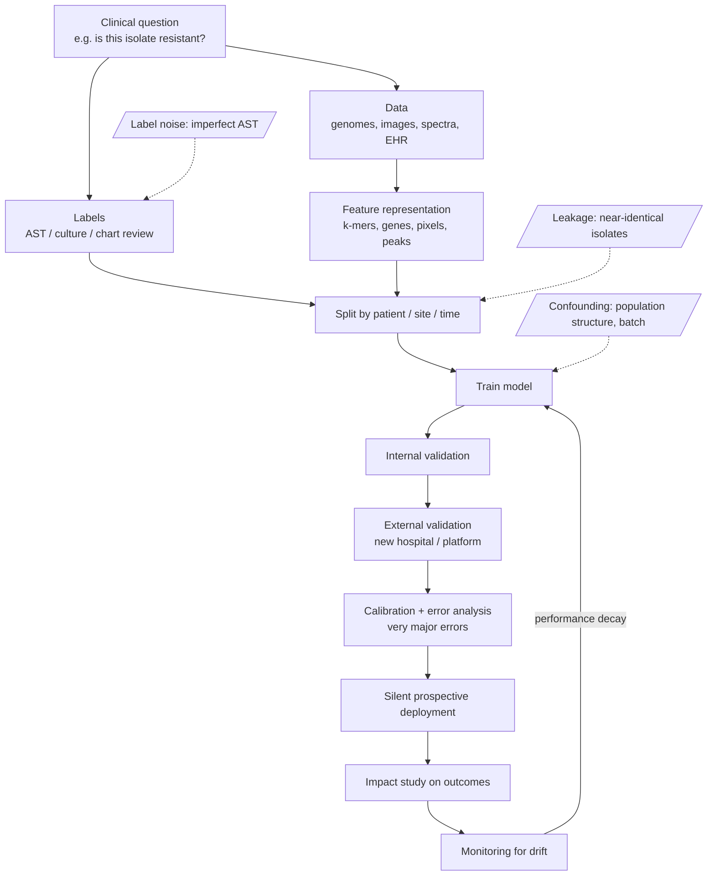

# Figure - Machine Learning Workflow in Microbiology

From clinical question to monitored deployment, with the failure points marked.

## How to read it
- The left column is data preparation; most published failures happen there, not in the model.
- Dashed boxes are the three classic microbiology-specific traps.
- Nothing below “external validation” is optional for clinical use.

## Related
- [[Machine Learning Basics for Microbiology]] · [[Model Evaluation in Clinical Microbiology]] · [[MOC - AI in Microbiology]]
