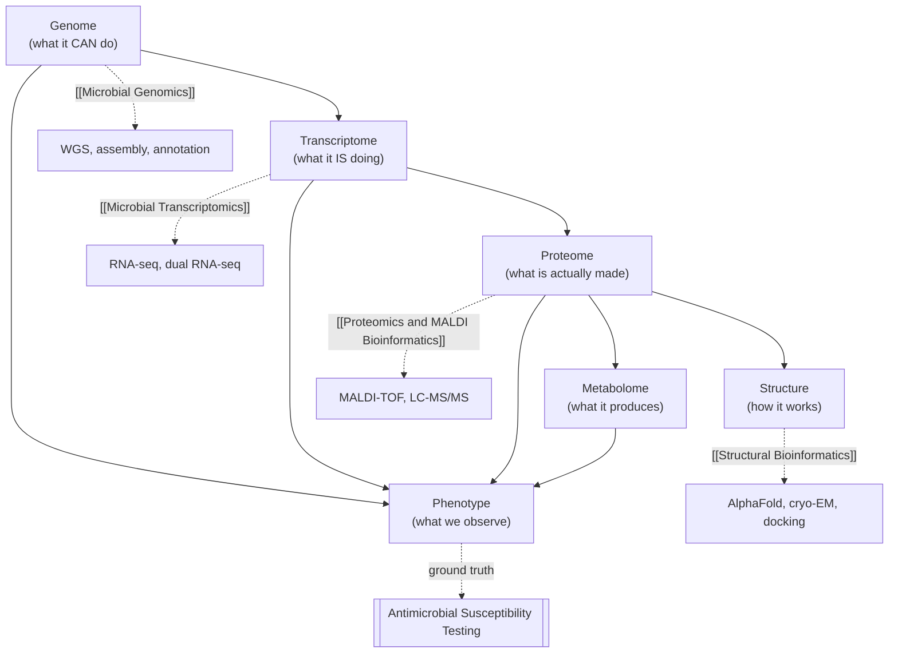

# Figure - Omics Layers in Microbiology

Which layer answers which question — and why genome alone is not enough.

## Key idea
Genotype-based prediction fails exactly where the causal step lives above the genome: efflux upregulation, porin loss, inducible enzymes, and persistence are transcript- or protein-level phenomena — see [[Genotype to Phenotype Prediction]].

## Related
- [[MOC - Bioinformatics in Microbiology]] · [[MOC - Antimicrobial Resistance (AMR)]]
