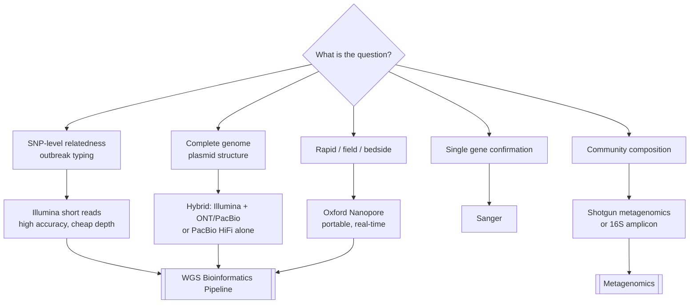

# Figure - Sequencing Platform Comparison

Choosing a platform by the question being asked.

## Trade-off summary

| Need | Best fit |
| :--- | :--- |
| Lowest cost per base, best per-base accuracy | Illumina |
| Repeat resolution, circular plasmids | PacBio HiFi or ONT |
| Turnaround measured in hours, portability | ONT |
| One amplicon, definitive confirmation | Sanger |

## Related
- [[Sequencing Technologies]] · [[Genome Assembly]] · [[Plasmid and Mobile Element Analysis]]
