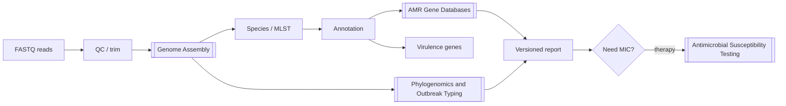

# Figure - WGS Bioinformatics Pipeline

## Purpose
Memorize the isolate WGS analysis order from FASTQ to report.

## Used In
- [[WGS Bioinformatics Pipeline]]
- [[MOC - Bioinformatics in Microbiology]]
- [[Whole-Genome Sequencing]]
- [[Learning Media Hub]]

## Diagram

## Teaching Legend
| Step | Failure mode |
| :--- | :--- |
| QC | Bad library → garbage assembly |
| Assembly | Broken plasmids → missed AMR context |
| AMR DB | Wrong version → discordant calls |
| Phylogeny | Ignoring epi → false outbreak |

## Quick Self-Check
1. Where does CARD/ResFinder run in this flow?
2. Why is AST still on the chart?
