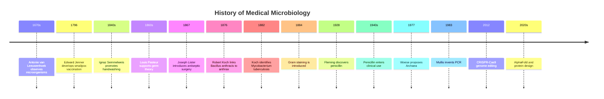

# Medical Microbiology History

![[banner-history-microbiology.png]]

## Overview
- **Related MOCs:** [[MOC - Fundamentals of Microbiology]] · [[Home]] · [[Encyclopedia Map]]
- **Summary:** Chronological timeline of key figures and discoveries that shaped medical [[Microbiology]], from the first microscopic observations to AI and computational biology.

## The Pioneers (1600s–1800s)
- **[[Antonie van Leeuwenhoek]] (1670s):** “Father of Microbiology.” Practical microscopes; first to observe and describe “animalcules.” See also [[Microscopy]].
- **[[Edward Jenner]] (1796):** First successful smallpox vaccine (cowpox) — foundation of immunization.
- **[[Ignaz Semmelweis]] (1840s):** Handwashing with chlorinated lime; infection control before germ theory was accepted.
- **[[Louis Pasteur]] (1860s–1880s):** Disproved spontaneous generation; [[Germ Theory]]; pasteurization; vaccines (rabies, anthrax).
- **[[Joseph Lister]] (1867):** Antiseptic surgery (carbolic acid) applying Pasteur’s ideas.
- **[[Robert Koch]] (1870s–1880s):** Etiologic agents of TB, cholera, anthrax; [[Koch’s Postulates]].

## The Golden Age & Chemotherapy (Early–Mid 1900s)
- **[[Paul Ehrlich]] (1909):** Salvarsan for syphilis; “magic bullet” / chemotherapy.
- **[[Alexander Fleming]] (1928):** Penicillin from *Penicillium notatum*.
- **[[Howard Florey]] & [[Ernst Chain]] (1940s):** Purification and clinical scale-up of penicillin.

## The Molecular & Genomic Era (Late 1900s–2010s)
- **[[Carl Woese]] (1977):** Archaea via 16S rRNA phylogeny — new tree of life.
- **[[Kary Mullis]] (1983):** Invented [[PCR]].
- **[[Jennifer Doudna]] & [[Emmanuelle Charpentier]] (2012):** CRISPR-Cas9 genome editing from bacterial immunity.

## The AI & Computational Era (2020s–Present)
- **[[Demis Hassabis]] & [[John Jumper]] (2020s):** AlphaFold — protein structure prediction at scale → [[AlphaFold in Microbiology]] · [[MOC - AI in Microbiology]]
- **[[David Baker]] (2020s):** Computational protein *design* → [[Protein Design for Antimicrobials]]
- **Computational hubs:** [[MOC - Bioinformatics in Microbiology]] · [[Microbial Genomics]] · [[AMR Gene Databases]]

## Foundational Concepts from This Timeline
- [[Germ Theory]]
- [[Koch’s Postulates]]
- [[Microbiology]]
- Methods spawned by history: [[light microscope]] · [[Gram Stain]] · [[PCR]]

## Notes & Connections
- How did Koch’s culture-based causality evolve into genomic surveillance?
- How will AlphaFold / protein design change AMR and antiviral research?

## Related Sources
- [[Jawetz, Melnick & Adelberg’s Medical Microbiology - Chapter 1]]
- [[Figure - Timeline of Medical Microbiology]]
- [[Timeline - History of Medical Microbiology.excalidraw]]
