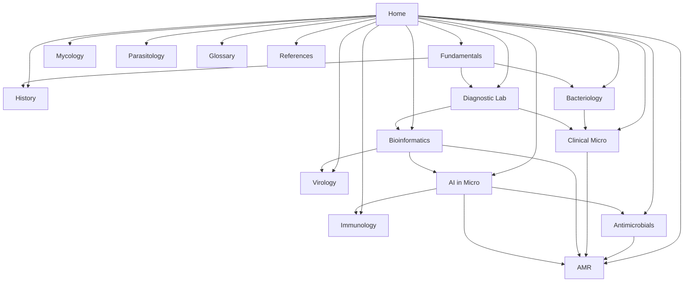

# Encyclopedia Map

Master blueprint for this vault. Build **depth before breadth**: finish a spine, then expand sideways.

Related: [[Home]]

---

## Target Architecture

### What each layer should contain

| Layer | Contents |
| :--- | :--- |
| **MOC** | Overview, subtopics, links to notes, open questions |
| **Concept notes** | One idea: definition → mechanism → clinical/research relevance |
| **Organism notes** | Taxonomy, virulence, disease, diagnosis, treatment, AMR |
| **Method notes** | Principle, steps, performance, clinical use |
| **History notes** | Who / when / contribution / why it still matters |
| **Glossary** | 1–3 sentence definitions + links out |
| **Source notes** | Book/paper → extract → link to atomic notes |

---

## Priority Backlog

### Phase 0 — Navigation ✅
- [x] [[Home]]
- [x] [[Encyclopedia Map]]
- [x] Frontmatter on major MOCs
- [x] Jawetz Ch1 core concept stubs created

### Phase 1 — Foundations spine ✅
**Goal:** History → germ theory → cell basics → genetics.

| Priority | Note / cluster | Status |
| :---: | :--- | :--- |
| P1 | [[MOC - Fundamentals of Microbiology]] | done |
| P1 | History hub + figures | done |
| P1 | [[Germ Theory]] · [[Koch’s Postulates]] | done |
| P1 | Cell structure cluster | done |
| P1 | Genetics / HGT cluster | done |
| P1 | [[Pathogen]] · [[Normal Microbiota]] · [[Microbial Classification]] · [[Infectious Disease]] | done |
| P2 | Metabolism (respiration/fermentation) deep notes | backlog |

### Phase 2 — Diagnostic spine ✅ (core)
| Priority | Note / cluster | Status |
| :---: | :--- | :--- |
| P1 | [[MOC - Diagnostic & Lab Methods]] | done |
| P1 | [[Gram Stain]] · [[Acid-Fast Stain]] · [[light microscope]] | done / exists |
| P1 | [[PCR]] · [[Reverse Transcription Polymerase Chain Reaction (RT-PCR)]] | done / exists |
| P1 | [[Culture and Isolation]] · [[Antimicrobial Susceptibility Testing]] · [[Whole-Genome Sequencing]] | done |
| P2 | MALDI-TOF, serology, 16S clinical notes | backlog |

### Phase 3 — Bacteriology core ✅ (starter set)
| Priority | Cluster | Status |
| :---: | :--- | :--- |
| P1 | [[MOC - Bacteriology]] classification tree | done |
| P1 | [[Staphylococcus aureus]] · [[Streptococcus pyogenes]] · [[Streptococcus pneumoniae]] | done |
| P1 | [[Escherichia coli]] · [[Klebsiella pneumoniae]] · [[Pseudomonas aeruginosa]] | done |
| P2 | Anaerobes, mycobacteria, atypicals, *Neisseria*, *Salmonella*… | backlog |

### Phase 4 — Clinical + antimicrobials + AMR ✅ (hubs)
| Priority | MOC | Status |
| :---: | :--- | :--- |
| P1 | [[MOC - Clinical Microbiology]] syndrome scaffold | done |
| P1 | [[MOC - Diseases by System]] + 10 system hubs | done |
| P1 | Individual disease notes (14 starter diseases) | done |
| P1 | [[MOC - Antimicrobials]] class scaffold | done |
| P1 | [[MOC - Antimicrobial Resistance (AMR)]] | done |
| P2 | More diseases (TB, influenza, HSV enceph, GC, PJI…); drug-class notes; ESBL/MRSA/CRE | backlog |

### Phase 5 — Other domains ✅ (scaffolds only)
| MOC | Status |
| :--- | :--- |
| [[MOC - Virology]] | scaffold done — virus pages backlog |
| [[MOC - Mycology]] | scaffold done — organism pages backlog |
| [[MOC - Parasitology]] | scaffold done — life-cycle notes backlog |
| [[MOC - Immunology]] | scaffold done — core concept notes backlog |

### Phase 6 — Computational layer ✅ (expanded)
| Priority | Item | Status |
| :---: | :--- | :--- |
| P1 | [[MOC - Bioinformatics in Microbiology]] (9 sections) | done |
| P1 | [[MOC - AI in Microbiology]] (6 sections) | done |
| P1 | Data foundations: [[Sequencing Technologies]] · [[Sequencing Data Formats]] · [[Read QC and Preprocessing]] | done |
| P1 | Genome layer: [[Genome Assembly]] · [[Genome Annotation]] · [[Variant Calling in Bacteria]] · [[WGS Bioinformatics Pipeline]] | done |
| P1 | Population layer: [[Comparative Genomics]] · [[Pangenome Analysis]] · [[Plasmid and Mobile Element Analysis]] · [[MLST and cgMLST]] | done |
| P1 | Phylogenetics: [[Phylogenetic Tree Building]] · [[Phylodynamics]] · [[Viral Genomics and Surveillance]] | done |
| P1 | Multi-omics: [[Microbial Transcriptomics]] · [[Proteomics and MALDI Bioinformatics]] · [[Structural Bioinformatics]] | done |
| P1 | Community: [[Metagenomics]] · [[16S Amplicon Analysis]] · [[Metagenome-Assembled Genomes]] · [[Microbiome Statistics]] | done |
| P1 | Practice: [[Reproducible Bioinformatics Workflows]] · [[Public Sequence Databases]] · [[FAIR Data and Genomic Surveillance]] | done |
| P1 | AI foundations: [[Machine Learning Basics for Microbiology]] · [[Deep Learning in Microbiology]] · [[Model Evaluation in Clinical Microbiology]] · [[AI Ethics in Clinical Microbiology]] | done |
| P1 | AI applications: [[AI for Antibiotic Discovery]] · [[AI for Vaccine Design]] · [[AI in Antimicrobial Stewardship]] · [[AI for Outbreak Detection]] · [[Digital Microscopy and Image AI]] · [[Genotype to Phenotype Prediction]] | done |
| P1 | Frontier: [[Protein Language Models]] · [[Foundation Models and LLMs in Microbiology]] | done |
| P1 | Study aids: [[Computational Microbiology Study Path]] · [[Bioinformatics and AI Glossary]] · [[Genomics Command-Line Cheatsheet]] · [[Bioinformatics Toolkit for Microbiology]] | done |
| P1 | Figures: [[Figure - Machine Learning Workflow in Microbiology]] · [[Figure - Omics Layers in Microbiology]] · [[Figure - Sequencing Platform Comparison]] | done |
| P2 | [[MOC - Public Health & Epidemiology]] (scaffold created here — concept notes pending) | scaffold |
| P2 | Worked datasets / notebooks, deeper Centner extraction | backlog |

### Phase 7 — Source pipeline (ongoing)
| Source | Action |
| :--- | :--- |
| Jawetz Ch1 | Atomic notes largely linked — continue extraction |
| Later Jawetz chapters | One chapter → many notes |
| [[Paper - AMR Database M.Centner 2026]] | Claim-level notes — use with [[AMR Gene Databases]] |

---

## Writing Rules (for this vault)

1. **One idea per note** when possible; MOCs stay thin hubs.
2. Use templates in `05_Templates` for new notes.
3. Always link: note → MOC, note → related methods/organisms, source → atomic notes.
4. Prefer English note titles for graph consistency.
5. Status: `draft` → `active` → `mastered` (methods).
6. After reading a source: update source note *and* create/update 1–3 atomic notes.

---

## Definition of “complete enough” for a domain

A domain MOC is “Phase-complete” when it has:

- [x] Overview *(all major MOCs)*
- [x] Key subtopics listed with links
- [x] ≥5 core concept notes linked *(Fundamentals, Bacteriology, Diagnostics, AMR)*
- [x] ≥3 organism or method notes linked *(Bacteriology / Diagnostics)*
- [x] Open questions
- [x] Links to related MOCs and at least one source
- [ ] Active recall bank per domain *(partial — on many notes, not centralized)*

---

## Learning media system

- Hub: [[Learning Media Hub]]
- Template: [[Template - Learning Aids]]
- Diagrams folder: `04_Figures_and_Media/Diagrams/`
- Pattern on notes: `## Learning Aids` → diagram + `> [!example]` + video table

### Phase 8 — Infrastructure & quality ✅
| Item | Status |
| :--- | :--- |
| [[Dashboard - Vault Health]] + [[Dashboard - Organisms and Diseases]] (Dataview) | done |
| `Encyclopedia.base` — Bases database views | done |
| `Microbiology Map.canvas` — visual index | done |
| `.obsidian/snippets/microbiology.css` — domain callouts, tag colours | done |
| [[Glossary Index]] + [[Glossary - Core Microbiology Terms]] + [[Glossary - Clinical and AMR Terms]] | done |
| [[Image Sources and Attribution]] + first 3 images | done |
| Link audit: 45 unresolved → 0 real ([[Vault Audit 2026-08-01]]) | done |
| AMR / Public Health / lab-method / organism gap notes (21) | done |

---

## Immediate next actions (remaining backlog)

1. First virus pages: influenza, HIV, SARS-CoV-2, HSV — [[MOC - Virology]] is still a scaffold.
2. Immunology core notes: innate vs adaptive, antibody classes, complement — [[MOC - Immunology]].
3. Mechanism notes: MRSA, ESBL, carbapenemases (currently only table rows in [[Mechanisms of Antibiotic Resistance]]).
4. *Candida* + *Aspergillus*; *Plasmodium*.
5. Metabolism notes under Fundamentals (respiration, fermentation, oxygen classes).
6. Remaining `(TBD)` organisms in disease notes: *N. meningitidis*, *Listeria*, *H. influenzae*, GBS, *Salmonella*.
7. Real images from CDC PHIL — wanted list in [[Image Sources and Attribution]].
8. Wire the Zotero connector into the `01_References/` folder; Jawetz Ch2+ extraction.
9. Add Learning Aids blocks to remaining organism/method notes.
